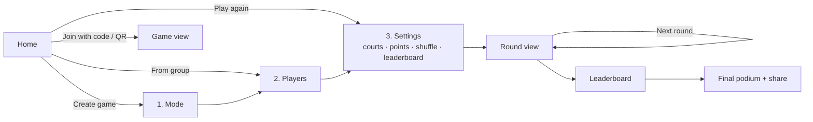

# Padel Americano App — Product Requirements Document (PRD)

| | |
|---|---|
| **Status** | Draft v0.2 |
| **Date** | 2026-09-24 |
| **Platforms** | Web (Next.js SSR + TS, v1) → Flutter iOS/Android (v2) |
| **Web hosting** | Cloudflare Workers (Next.js via OpenNext adapter) |
| **Backend** | Firebase (Auth, Firestore, Cloud Functions) |
| **Analytics** | Amplitude |
| **UI style** | Black & white, casual-professional (see §3a) |
| **Discovery** | SEO + GEO (generative-engine / AI-agent optimization) |
| **Reference** | [padelution.com/americano](https://www.padelution.com/americano/americano) |
| **Companion doc** | [REQUIREMENTS.md](./REQUIREMENTS.md) |

---

## 1. Vision

> **Start a fair padel Americano in under 30 seconds.**

Casual padel groups and club organizers need a quick way to generate fair rotations, record scores on court, and show a live leaderboard. Existing tools work, but they feel heavy, want you to register first, or aren't built for a phone held in a sweaty hand between points.

Our app is **simple, mobile-first and pleasant to use**:
- **No account is needed to play.** You can create and run a game as a guest.
- **Signing in with Google** adds history, saved groups, "play again", and joining other people's games.
- **All popular formats** are supported: Americano, Mexicano, Mixicano, team variants, Beat the Box, Up & Down.

## 2. Personas

| Persona | Context | Needs |
|---|---|---|
| **Organizer** ("Anna") | Books 2 courts for 8–12 friends every Sunday. Sets up the game at the court on her phone. | Fast setup, reuse of last week's players, easy score entry, fair sit-outs. |
| **Player** ("Mikko") | Plays in Anna's games and sometimes organizes his own. | Sees who he plays next and his live rank. Keeps personal history and stats. |
| **Spectator / latecomer** | Friend or club staff looking at the court screen or a shared link. | Opens the link and immediately sees the live leaderboard. No login. |
| **Club host** (later) | Runs weekly social nights on 4–6 courts. | Multiple courts, projected leaderboard, recurring groups. |

## 3. Product principles

1. **One primary action per screen.** Big, thumb-reachable CTAs.
2. **Smart defaults.** Americano, Balanced shuffle, 24 points and Total points leaderboard are pre-selected, so an organizer can finish setup by tapping Next.
3. **Guest first, account later.** Never block play behind a login. Offer sign-in when it adds value, e.g. "Save this game to your history?".
4. **Fairness is visible.** Show who sits out and why. Show partner/opponent balance.
5. **Works on a bad connection.** Courts often have weak signal, so offline scoring is a must.
6. **Findable by people and by AI agents.** Public pages are server-rendered, fast, and machine-readable, so search engines and assistants (ChatGPT, Claude, Perplexity, Gemini) can find, understand, cite and deep-link into the app.

## 3a. Visual design direction

**Black and white, casual-professional.** The look is calm, confident, sporty and never loud: think a well-designed scoreboard, not a gaming app.

- **Palette**:
  - Monochrome: near-black `#0A0A0A`, white `#FFFFFF`, and a neutral grey scale (`#F5F5F5`, `#E5E5E5`, `#A3A3A3`, `#525252`) for surfaces, borders and secondary text.
  - No brand hue. Emphasis comes from contrast, weight and inversion (a black primary button on white, a white one on black in dark mode).
  - Colour is used only for **functional state** and sparingly: green ▲ / red ▼ rank movement, and a red error. Each state is always paired with an icon or text, never colour alone.
- **Typography**:
  - One clean grotesk sans (e.g. Inter or Geist) for everything.
  - Tabular numerals for scores and standings.
  - Large bold numbers for scores; relaxed sentence-case copy.
- **Shape and space**: generous whitespace, 12–16 px radius cards, 1 px hairline borders instead of heavy shadows, a clear 4/8 px spacing grid.
- **Tone of voice**: friendly and brief ("Nice match!", "Round 3 is ready"), never slangy. Buttons are verbs ("Start game", "Next round").
- **Imagery**: simple line icons (one set, e.g. Lucide) and a monochrome court diagram for each mode. No stock photos in the app. The marketing pages may use black-and-white photography.
- **Dark mode** is a true inversion of the same system: black ground, white type.
- **Motion**: subtle 150–200 ms transitions. A single celebratory moment on the final podium, kept tasteful and monochrome.

## 4. Core user flow

### 4.1 Screen-by-screen

1. **Home**
   - Primary CTA: **Create game**.
   - Secondary: **Play again** (last 3 setups as cards), **Groups**, **Join with code**.
   - Signed-in users also see "Your games" (live and recent).
   - Guests see a subtle "Sign in with Google" button in the header.
2. **Choose mode**: 8 cards, each with an icon, a one-line explanation and an "i" for details. Americano is pre-selected.
3. **Players**
   - Count stepper (−/+). Names are optional and are auto-filled "Player 1…N".
   - Quick-add chips come from recent players and groups.
   - Team modes enter pairs. Mixicano tags each player with side A/B.
4. **Settings**
   - Game name (auto: "Sunday Americano · 23 Sep")
   - Courts
   - Points per match
   - **Shuffle mode**
   - **Leaderboard mode**
   - Rounds
   - A live summary strip: *"14 matches · 7 per player · ~1h 59m"*.
5. **Round view**
   - A court card per court: Team A vs Team B with big score steppers.
   - A "Sitting out" row.
   - Round tabs/progress. A **Next round** button that becomes active when all scores are in.
6. **Leaderboard**: live standings table with rank, name, points, W/L/D, matches, and diff. Movement arrows ▲▼ since the last round.
7. **Finish**: podium (top 3), full table, and a **share image** (PNG) plus link.
8. **Share sheet**: link `/g/{CODE}`, QR code, 6-char code, and "Copy standings as text".
9. **Profile** (signed-in): history, stats (games, win %, avg points), groups, and sign out / delete account.

## 5. Game modes (in scope for v1)

| Mode | Partners | Pairing logic | Typical use |
|---|---|---|---|
| **Americano** | Rotate every round | Pre-computed schedule, every partner once | Classic social game |
| **Team Americano** | Fixed pairs | Round-robin of pairs | Couples / fixed teams night |
| **Mexicano** | Rotate | By current standings (1+4 vs 2+3 per court) | Competitive, levels out skill |
| **Team Mexicano** | Fixed pairs | Pairs matched by team standings | Competitive fixed teams |
| **Mixicano** | Rotate, always one from each side | Mexicano within two sides (e.g. M/F) | Mixed social events |
| **Beat the Box** | Rotate inside a box of 4 | 3 games per box, then regroup by results | Clubs, many courts |
| **Up & Down** | Split after each round | Winners move up a court, losers down | "King of the court" |
| **Team Up & Down** | Fixed pairs | Winning pair up, losing pair down | Fixed teams, ladder feel |

Detailed algorithms are in [REQUIREMENTS.md §FR-6](./REQUIREMENTS.md#fr-6-pairing--scoring-engine).

## 6. Accounts & identity

- **Anonymous by default.** Firebase Anonymous Auth runs silently. The guest's games are stored in the cloud (so sharing works) and cached offline.
- **Sign in with Google** (Firebase Auth) is available anytime. The anonymous account is **linked**, so nothing is lost.
- **Signed-in users unlock:**
  - History and personal stats
  - **Play again** from recent setups
  - **Groups** (saved player lists)
  - **Join games** and claim a player slot, so the game appears in their history
  - Multi-device access to their games
- **AI assistants** can create and run anonymous games for a user through our MCP server. Two links come back: a spectator link to share, and an organizer link to continue on a phone.

## 7. Key user stories

| ID | As a… | I want to… | So that… |
|---|---|---|---|
| US-01 | guest organizer | create and run an Americano without signing in | I can start right away at the court |
| US-02 | organizer | pick the player count, courts and points in one screen | setup takes seconds |
| US-03 | organizer | choose a shuffle mode (balanced/random/standings/manual) | pairings suit my group |
| US-04 | organizer | choose how the leaderboard ranks players | the winner feels fair |
| US-05 | organizer | enter a score with one side auto-completed | scoring is quick and error-free |
| US-06 | organizer | edit a past score | mistakes don't ruin the result |
| US-07 | organizer | share a link/QR | players can follow the leaderboard on their phones |
| US-08 | player | sign in with Google and join a game by code | the game is saved to my history |
| US-09 | player | claim my name in a game | my points count toward my stats |
| US-10 | guest | sign in after playing | my guest games are kept |
| US-11 | organizer | "play again" with last week's setup and players | I don't retype names |
| US-12 | organizer | save a group ("Sunday crew") and start a game from it | recurring games are one tap |
| US-13 | organizer | add a late player or remove an injured one | the game adapts mid-session |
| US-14 | spectator | open a link without logging in | I can follow the live standings |
| US-15 | organizer | keep scoring when offline | a bad signal at the court doesn't stop the game |
| US-16 | organizer using an AI assistant | say "set up an Americano for these 10 people on 2 courts" | the assistant creates the game and gives me a link to share |
| US-17 | organizer using an AI assistant | tell it the scores ("court 1 was 15–9") and ask "who's leading?" | I can run the session hands-free |
| US-18 | organizer | open a game my assistant created on my phone and keep editing it | I'm not locked into the chat |

## 8. Scope & milestones

| Milestone | Content | Platform |
|---|---|---|
| **M0 — Foundations** | Monorepo, Next.js (App Router) + TS on Cloudflare Workers via OpenNext, Firebase project (dev/prod), Emulator Suite, CI with per-PR preview deploys, SEO baseline (metadata, robots, sitemap) | Web |
| **M1 — Engine** | `packages/engine`: all 8 modes, scoring, standings, sit-out fairness, shared JSON fixtures | TS library |
| **M2 — Guest MVP** | Anonymous create → run → finish for Americano and Mexicano. Live leaderboard. Server-rendered share link with OG image. Offline scoring. Landing page. | Web |
| **M3 — Accounts** | Google sign-in, anonymous linking, join by code/QR, claim player slot, history | Web |
| **M4 — Full modes & reuse** | Remaining 6 modes in the UI, Groups, Play again, recent players | Web |
| **M5 — Polish & discovery** | PWA install, share image, dark mode, i18n scaffold (EN), analytics, accessibility pass. **SEO/GEO content**: mode guides, programmatic schedule pages, `llms.txt`, Markdown mirrors, public schedule API. | Web |
| **M5b — Agent access** | **MCP server** (FR-8): AI assistants create anonymous games, join existing ones by code, enter scores and read standings. Hand-off to phones via spectator and organizer links. Plus the public schedule API + OpenAPI. | Cloudflare Worker |
| **M6 — Mobile** | Flutter app (iOS/Android) on the same backend. Dart port of the engine validated against the shared fixtures. Push notifications ("Round 3 is ready"). | Flutter |

### Out of scope (v1)
Payments, court booking, cross-session ELO/ratings, chat, push notifications (planned for M6), multi-day tournaments and brackets, club admin dashboards.

## 9. Success metrics

| Metric | Target |
|---|---|
| Time from "Create game" to round 1 on screen | < 30 s median |
| Games started that reach "Finish" | > 70 % |
| Guest → Google sign-in conversion | > 25 % of guests who finish a game |
| Organizers who create a 2nd game within 14 days | > 40 % |
| "Play again" / group share of new games | > 30 % after M4 |
| Organic + AI-referral share of new organizers | > 40 % within 6 months of M5 |
| Indexed public pages (Google Search Console) | > 150 within 3 months of M5 |
| Citations in AI answers for "padel americano schedule/generator" (manual monthly check across ChatGPT, Claude, Perplexity, Gemini) | Cited in ≥ 2 of 4 |

## 10. Risks & open questions

- **Americano schedule fairness for awkward counts** (e.g. 7, 11, 13 players): we need solid sit-out rotation and "least-repeat" heuristics instead of perfect schedules.
- **Concurrent score edits** from several devices are handled with Firestore transactions and last-write-wins per match, with an edit log.
- **Google sign-in on iOS Safari / in-app browsers** (WhatsApp, Instagram) can fail. Use redirect flow and an "Open in browser" hint. Serve Firebase's auth handler from our own domain (proxy `/__/auth/*`) so redirect sign-in isn't broken by third-party storage blocking.
- **Next.js on Cloudflare Workers** relies on the OpenNext adapter. Some Node APIs are not available, so the Firebase Admin SDK is not used in the web server. Server-side reads use the Firestore REST API, and privileged work stays in Firebase Cloud Functions.
- **Privacy vs. SEO**: games contain people's names, so game pages are `noindex` by default. Only content pages, and games the organizer explicitly makes public, are indexable.
- **Open questions**: see [REQUIREMENTS.md §11](./REQUIREMENTS.md#11-open-questions).
