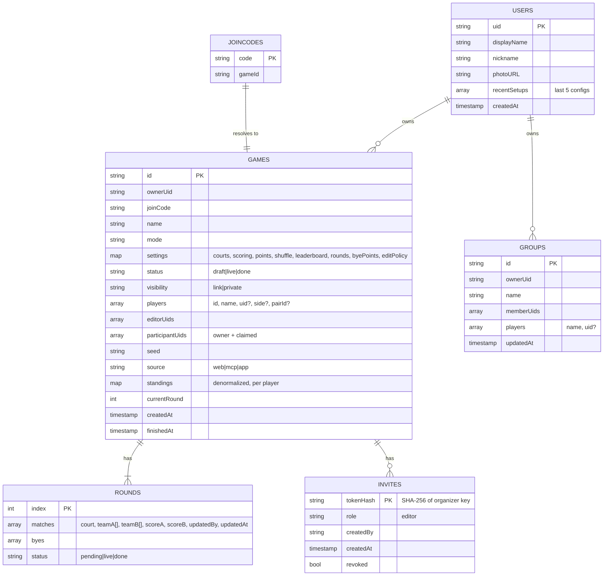

# Padel Americano App — Requirements Specification

| | |
|---|---|
| **Status** | Draft v0.2 |
| **Date** | 2026-09-24 |
| **Product doc** | [PRD.md](./PRD.md) |

Priority key: **P0** = MVP (M2–M3), **P1** = v1 complete (M4–M5), **P2** = later.

---

## 1. Glossary

| Term | Meaning |
|---|---|
| **Game** | One session (e.g. "Sunday Americano") with a mode, players, settings and rounds. |
| **Round** | A set of matches played simultaneously, one per court, plus the players sitting out. |
| **Match** | Team A (2 players) vs Team B (2 players) on one court. |
| **Bye / sitting out** | A player who doesn't play in a round because there are more players than court slots. |
| **Shuffle mode** | The strategy for forming partners and opponents each round. |
| **Leaderboard mode** | The ranking rule for standings. |
| **Organizer** | The creator (owner) of a game. |
| **Editor** | A user allowed to enter scores (owner, plus others if permitted). |

---

## FR-1 Game setup

| ID | Requirement | Priority |
|---|---|---|
| FR-1.1 | User can pick one of 8 modes: Americano, Team Americano, Mexicano, Team Mexicano, Mixicano, Beat the Box, Up & Down, Team Up & Down. Default is **Americano**. | P0 (Americano, Mexicano) / P1 (others) |
| FR-1.2 | Game name is optional. It defaults to `"{Mode} · {weekday date}"`. | P0 |
| FR-1.3 | **Player count** uses a −/+ stepper. Individual modes: **4–24** players. Team modes: **2–12 teams** (4–24 players). | P0 |
| FR-1.4 | Player names are optional. Blank names default to "Player N". Names are unique within a game (duplicates get a suffix). Max 24 chars. | P0 |
| FR-1.5 | **Mixicano** requires each player to be tagged Side A / Side B (labels are editable, default "Men/Women"). Both sides must have equal counts, and the Start button stays disabled with a hint until they do. | P1 |
| FR-1.6 | **Beat the Box** requires the player count to be a multiple of 4 (a validation hint suggests the nearest valid count). | P1 |
| FR-1.7 | **Courts**: 1 to `min(6, floor(players/4))`. The default is the max for ≤ 2 courts, else 2. Court names are editable ("Court 1", "Center"…). | P0 |
| FR-1.8 | **Sit-outs** happen when `players > courts × 4`. Byes are distributed fairly: nobody sits a 2nd time until everyone has sat once. Byes never repeat in consecutive rounds unless unavoidable. | P0 |
| FR-1.9 | **Scoring type**: <br>• **Total points**: match is played to a fixed total (16/21/24/32/custom 4–64). Entering one side auto-fills the other. Default **24**.<br>• **First to N**: first team to N wins (other side 0…N−1).<br>• **Timed**: X minutes per round, any score allowed.<br>• **Off**: result only (Win / Draw / Loss). | P0 (Total, Off) / P1 (First to, Timed) |
| FR-1.10 | **Shuffle mode** (see §FR-6.2): **Balanced** (default), **Random**, **By standings**, **Manual**. Modes that define their own pairing (Mexicano family, Up & Down, Beat the Box) lock or limit the options and explain why. | P0 |
| FR-1.11 | **Leaderboard mode** (see §FR-6.4): **Total points** (default), **Wins first**, **Average points per match**. | P0 |
| FR-1.12 | **Rounds**: *Auto* (a full rotation: every partner once in Americano, or a full round-robin in team modes), *Fixed N* (1–30), or *Open-ended* (the organizer taps "Next round" until "Finish"). Mexicano and Up & Down default to Fixed 7 / Open-ended. | P0 |
| FR-1.13 | A **summary strip** updates live: total matches, matches per player (min–max if uneven), sit-outs per player, and estimated duration. | P0 |
| FR-1.14 | **Duration estimate** = `rounds × (points × 35 s + 3 min changeover)` for Total points. For Timed it is `rounds × (minutes + 3)`. Constants are configurable. Example: 7 rounds × 24 pts ≈ **1h 59m**. | P0 |
| FR-1.15 | All setup screens keep a draft (local state), so the back button never loses input. | P0 |

## FR-2 Running a game

| ID | Requirement | Priority |
|---|---|---|
| FR-2.1 | The round view shows one **court card** per match: Team A names, Team B names, score steppers (−/+ and tap-to-type), and court name. | P0 |
| FR-2.2 | Entering a score takes **≤ 2 taps** in the common case. With Total points, tapping a preset (e.g. 13) auto-fills the other side (11). | P0 |
| FR-2.3 | A **"Sitting out"** row lists bye players for the round. | P0 |
| FR-2.4 | **Next round** is enabled once all matches have scores. Standings-based modes generate the next round *only* at this point. Schedule-based modes can preview all rounds. | P0 |
| FR-2.5 | Any past score can be **edited**. Standings are recomputed. For standings-based modes, *future, unplayed* rounds are regenerated after a confirmation ("Rounds 4–5 will be reshuffled"). Played rounds never change. | P0 |
| FR-2.6 | **Manual shuffle**: before a round starts (no scores entered), the organizer can swap players by drag-and-drop or tap-to-swap. | P1 |
| FR-2.7 | **Add a late player / remove a player** mid-game affects only future rounds. The leaderboard handles uneven match counts (suggest the *Average* leaderboard mode when counts diverge). | P1 |
| FR-2.8 | **Score edit permission**: *Organizer only* (default) or *Any joined player*. The organizer can also grant editor rights to specific joined users. | P1 |
| FR-2.9 | Realtime sync: all viewers see score/standings updates in **< 2 s** online. | P0 |
| FR-2.10 | **Offline**: scores can be entered with no connection and sync on reconnect. A status pill shows *Synced / Offline / Syncing*. | P0 |
| FR-2.11 | **Finish game** freezes the results (status `done`) and shows the podium, full table and share options. The organizer can reopen within 24 h. | P0 |
| FR-2.12 | **Timed mode**: an optional round timer with a vibrate/sound at the end, shown on the round view. | P2 |
| FR-2.13 | **Big screen view** (`/g/{code}/tv`): a landscape leaderboard plus the current round, auto-refreshing, for a club TV. | P2 |

## FR-3 Authentication & identity

| ID | Requirement | Priority |
|---|---|---|
| FR-3.1 | On first create/join, the app signs in with **Firebase Anonymous Auth** silently. No UI. | P0 |
| FR-3.2 | **Sign in with Google** via Firebase Auth: `signInWithPopup` on desktop, `signInWithRedirect` on mobile / in-app browsers. The Firebase `authDomain` is our own domain. Next.js rewrites proxy `/__/auth/*` and `/__/firebase/*` to `{project}.firebaseapp.com`, so redirect sign-in works despite third-party storage blocking (Safari, Chrome). | P0 |
| FR-3.3 | If the current user is anonymous, Google sign-in **links** the credential (`linkWithPopup`/`linkWithRedirect`) and keeps the same UID and data. | P0 |
| FR-3.4 | If linking fails with `auth/credential-already-in-use`, sign in to the existing Google account and call the `mergeAnonymousUser` Cloud Function. It transfers game ownership/participation from the old anonymous UID. | P0 |
| FR-3.5 | The profile shows display name and photo from Google. The nickname is editable and used as the default player name in games you join. | P1 |
| FR-3.6 | **Sign-in prompts** appear contextually: after finishing a game ("Save to your history"), on Join, and on Groups. They are always dismissible. | P0 |
| FR-3.7 | **Delete account** removes the user doc, groups and history references. Games they own are anonymised (the owner name is removed) but remain viewable for other participants. | P1 |

## FR-4 Joining & sharing

| ID | Requirement | Priority |
|---|---|---|
| FR-4.1 | Each game gets a unique **6-char join code** made of uppercase letters and digits, excluding the ambiguous `0 O 1 I L`. | P0 |
| FR-4.2 | Share sheet: URL `https://{domain}/g/{CODE}`, **QR code**, copy code, and native share (Web Share API). | P0 |
| FR-4.3 | Game visibility is **Link** (default: anyone with the link/code can view) or **Private** (only owner and editors can view). | P1 |
| FR-4.4 | Opening a link works for anyone, with no sign-in UI. The page is **server-rendered** with the current round and standings, so it is readable instantly, without JS, and in link previews. The client then hydrates and subscribes for live updates, creating an anonymous session in the background only when needed. | P0 |
| FR-4.5 | **Join with code**: an input on Home that navigates to the game. | P0 |
| FR-4.6 | A signed-in user viewing a game can **claim a player slot** ("I'm Mikko"). The slot gets their UID and the game appears in their history. A slot can only be claimed once. The organizer can unassign it. | P0 |
| FR-4.7 | The organizer can **add players by account**: joined users can be added directly as players while the game is in draft. | P1 |
| FR-4.8 | **Share image**: a generated PNG of the podium and top standings (client-side canvas). | P1 |
| FR-4.9 | "Copy standings as text" produces a plain-text leaderboard for WhatsApp. | P1 |

## FR-5 History, recent setups & groups

| ID | Requirement | Priority |
|---|---|---|
| FR-5.1 | **History** (signed-in) lists games the user owns or has claimed a slot in, newest first. Each entry shows date, mode, rank and points. Live games are pinned on top. | P0 |
| FR-5.2 | **Guest history**: guests also see games created on this device (by anonymous UID). A banner says "Sign in to keep these forever". | P0 |
| FR-5.3 | **Play again**: from Home (last 3) or any history entry, cloning mode + settings + players (names and linked UIDs) into a new draft that opens at the Players step. | P1 |
| FR-5.4 | **Recent setups** are stored as the last 5 distinct configurations in the user profile. | P1 |
| FR-5.5 | **Groups**: create a named group (e.g. "Sunday crew") with a player list of guest names and/or linked users. CRUD operations are supported. | P1 |
| FR-5.6 | **Start from group**: pick a group, select who is playing today (checkboxes, all selected by default), then continue to mode/settings. | P1 |
| FR-5.7 | **Shared groups**: the owner can invite others via a link. Members can view the group and create games from it. Only the owner edits it. | P2 |
| FR-5.8 | **Recent players** autocomplete in name fields, using names from the last 20 games. | P1 |
| FR-5.9 | **Personal stats**: games played, wins (1st places), average rank, average points per match, and favourite partner. | P2 |

## FR-6 Pairing & scoring engine

The engine is a **pure TypeScript package** (`packages/engine`) with no I/O and no Firebase imports. It is **deterministic**: the same state and seed always produce the same output. The Flutter app will use a Dart port that must pass the **same JSON fixtures** (`packages/engine/fixtures/*.json`).

### FR-6.1 API (indicative)

```ts
createGame(config: GameConfig, players: Player[], seed: string): GameState
generateRound(state: GameState): Round            // next round
previewSchedule(state: GameState): Round[] | null // for schedule-based modes
applyScore(state, roundIdx, matchIdx, score): GameState
computeStandings(state: GameState): Standing[]
estimate(config, playerCount): { rounds, matches, perPlayer, byesPerPlayer, minutes }
validate(config, players): ValidationError[]
```

### FR-6.2 Shuffle modes

| Shuffle | Behaviour | Applies to |
|---|---|---|
| **Balanced** (default) | Minimise a cost function: repeated partners (weight 10), repeated opponents (weight 3), consecutive byes (weight 20), bye count imbalance (weight 50). Use a perfect round-robin schedule when one exists (e.g. 4, 8, 12, 16 players), otherwise greedy + local-search from the seed. | Americano, Team Americano |
| **Random** | Seeded random pairing each round. Bye fairness still holds. | Americano, Team Americano |
| **By standings** | Pair by current rank (see Mexicano). | Mexicano family (forced) |
| **Manual** | Balanced proposal, then the organizer edits before the round starts. | All except Beat the Box |

### FR-6.3 Mode algorithms

| Mode | Algorithm |
|---|---|
| **Americano** | Individual. Each round, form partners and opponents per the shuffle mode. Each player's score is **the points their team scored** in each match. *Auto* rounds = `N−1` for N ≡ 0 (mod 4) with a full partner rotation, otherwise enough rounds that every player has partnered as many others as possible. |
| **Team Americano** | Fixed pairs (entered in setup). Round-robin of pairs (circle method), with byes for the odd pair out when `pairs > courts × 2`. |
| **Mexicano** | Round 1: balanced/random (or by seed ranking if provided). Round k>1: sort players by standings. Players sitting out are chosen by bye fairness from the whole field. Chunk the remaining players into groups of 4 by rank. Within a group, ranks **1+4 vs 2+3**. Court 1 is the top group. |
| **Team Mexicano** | Fixed pairs sorted by team standings, matched 1v2, 3v4, … |
| **Mixicano** | Two sides A/B. Each team = one A + one B. Round k>1: sort each side by standings. Group the top 2 of A and top 2 of B per court: A1+B2 vs A2+B1. Round 1 is random within that constraint. |
| **Beat the Box** | Players split into boxes of 4 (box 1 = court 1). A "box cycle" is 3 rounds in which the box plays all 3 partner combos (AB‑CD, AC‑BD, AD‑BC). After a cycle, rank within each box: the box winner moves up one box and the box last moves down one (box 1 winner and last box loser stay). Initial boxes are random or by seed ranking. |
| **Up & Down** | Individual. Players are placed on courts (court 1 = top). After each round, the winning team's players move **up** one court and the losers move **down** (top winners and bottom losers stay). On the new court, the 4 players are paired so that previous partners are split (winner from above + winner from below vs the other two). Draws are decided by point diff, then random with the seed. |
| **Team Up & Down** | The same as Up & Down with fixed pairs: the winning pair moves up and the losing pair moves down. |

### FR-6.4 Scoring & standings

| ID | Requirement |
|---|---|
| FR-6.4.1 | Per player (or pair in team modes) the engine tracks: matches played, wins, draws, losses, points for, points against, diff, byes. |
| FR-6.4.2 | **Total points** leaderboard: sort by points for → diff → wins → head-to-head → name. |
| FR-6.4.3 | **Wins first** leaderboard: sort by wins (draw = ½) → diff → points for → head-to-head. |
| FR-6.4.4 | **Average** leaderboard: sort by points for ÷ matches → diff ÷ matches → wins. Recommended automatically when match counts are uneven. |
| FR-6.4.5 | **Byes**: default is no points. An optional setting awards the **average points per match** of the bye player so far (or half the match total in round 1). |
| FR-6.4.6 | **Scoring "Off"**: record W/D/L only. The leaderboard is forced to Wins first. |
| FR-6.4.7 | Standings are exposed with rank changes compared to the previous round (▲▼). |

### FR-6.5 Engine acceptance criteria (fixture tests)

- **AC-E1**: 8 players, 2 courts, Americano, Auto → **7 rounds, 14 matches, 7 per player**. Every player partners every other player **exactly once**. 0 byes.
- **AC-E2**: 10 players, 2 courts, Americano, 5 rounds → each player sits out **exactly once**, and nobody sits out twice in a row.
- **AC-E3**: 5 players, 1 court, Americano, 5 rounds → each player sits out exactly once and every pair partners at most once.
- **AC-E4**: Mexicano, 8 players, round 2 → court 1 contains the ranks 1–4 from round 1, paired 1+4 vs 2+3.
- **AC-E5**: Mixicano with 4A+4B → every team has exactly one A and one B in every round.
- **AC-E6**: Up & Down, 12 players, 3 courts → after round 1, the court-2 winners are on court 1 and the court-1 losers are on court 2. No repeat partner on the same court.
- **AC-E7**: Beat the Box, 8 players → after 3 rounds each box has played all 3 combos. Then box1 last ⇄ box2 winner.
- **AC-E8**: Same seed + same inputs → identical output (determinism). Different seeds → different Random schedules.
- **AC-E9**: Editing the round-1 score in Mexicano regenerates round 2 only if round 2 has no scores yet.
- **AC-E10**: Estimate for 8 players / 2 courts / 24 pts → `~1h 59m`.

## FR-7 SEO & GEO (search engines and AI agents)

**Goal:** when someone asks Google *or* an AI assistant "how does padel Americano work", "Americano schedule for 10 players on 2 courts" or "padel Mexicano generator", our pages should be the answer that gets shown, cited or linked, and agents should be able to send users straight into a pre-filled game setup.

### FR-7.1 Rendering & crawlability

| ID | Requirement | Priority |
|---|---|---|
| FR-7.1.1 | All public pages are **server-rendered** (Next.js App Router, React Server Components). Content, headings, tables and links are present in the initial HTML, with no JS needed to read them. | P0 |
| FR-7.1.2 | Rendering strategy by page type:<br>• **SSG/ISR** for marketing, guides and schedule pages.<br>• **SSR with edge caching** for public game pages (live games: `s-maxage=10`; finished games: long cache, purged on change).<br>• **Client-rendered** app-only screens (setup wizard state, profile). See §8.6. | P0 |
| FR-7.1.3 | Semantic HTML: one `<h1>` per page, a logical heading hierarchy, real `<table>` elements for schedules and standings (never canvas/images), and `<nav>`, `<main>` and `<article>` landmarks. | P0 |
| FR-7.1.4 | Clean, stable, lowercase, hyphenated URLs. Trailing-slash policy enforced with 301s. A single canonical per page. | P0 |
| FR-7.1.5 | `noindex, follow` on private or personal routes: `/me/*`, `/new/*`, `/join`, and game pages by default (they contain people's names). An organizer can mark a finished game **"Public results"**, which makes it indexable (FR-7.3.6). | P0 |

### FR-7.2 Metadata & structured data

| ID | Requirement | Priority |
|---|---|---|
| FR-7.2.1 | Every page sets `title` (≤ 60 chars), `description` (≤ 155 chars), canonical, Open Graph and Twitter card metadata via the Next.js Metadata API (`generateMetadata`). | P0 |
| FR-7.2.2 | **Dynamic OG images** (`opengraph-image.tsx`, `next/og`) in the black-and-white style:<br>• game pages show the current top 3 and the round<br>• schedule pages show "10 players · 2 courts · 5 rounds"<br>• mode guides show the mode name and diagram | P0 |
| FR-7.2.3 | **JSON-LD** structured data:<br>• `WebApplication` (with `applicationCategory: SportsApplication`, `offers: free`) and `Organization` on Home<br>• `HowTo` + `FAQPage` on mode guides<br>• `BreadcrumbList` on all content pages<br>• `SportsEvent` on public game results (name, date, location if given, participants' first names only with consent)<br>• `Dataset`/`Table` description on schedule pages | P1 |
| FR-7.2.4 | `app/sitemap.ts` generates `sitemap.xml` (split into indexes when > 1,000 URLs) with `lastModified`. `app/robots.ts` generates `robots.txt`. | P0 |
| FR-7.2.5 | `hreflang` alternates once more than one language ships (NFR-6). Locale is in the path (`/fi/...`), with EN at the root. | P2 |

### FR-7.3 Content for discovery

| ID | Requirement | Priority |
|---|---|---|
| FR-7.3.1 | **Landing page** (`/`): value proposition, "Create game" CTA, a 3-step how-it-works, links to all modes, and a short FAQ. The server-rendered landing is also the app Home. Signed-in extras hydrate client-side. | P0 |
| FR-7.3.2 | **Mode guides** (`/modes/{mode}`), one per mode (8 pages). Each covers:<br>• a 2–3 sentence **direct-answer summary** at the top, which answer engines quote<br>• rules and scoring<br>• a diagram<br>• an example schedule table<br>• when to choose it<br>• a comparison with other modes<br>• FAQ<br>• a "Start a {mode}" CTA pre-filled with that mode | P1 |
| FR-7.3.3 | **Programmatic schedule pages** (`/schedule/{mode}/{players}-players-{courts}-courts`). They are generated at build time with the engine for all valid combinations (Americano, Team Americano, Mexicano round 1; 4–24 players; 1–6 courts), about 200 pages. Each page shows:<br>• the full round-by-round table and sit-out list<br>• fairness stats and estimated duration<br>• a printable view<br>• a **"Play this schedule"** CTA that opens `/new?mode=…&players=…&courts=…` | P1 |
| FR-7.3.4 | **Compare & learn pages**: "Americano vs Mexicano", "How to score padel Americano", "Best format for 6 / 10 / 12 players". Topics are driven by Search Console queries. | P2 |
| FR-7.3.5 | Content pages show an author/organization byline, a `dateModified`, and cite official padel rules where relevant (E-E-A-T and freshness signals). | P1 |
| FR-7.3.6 | **Public results** (opt-in): a finished game with public results is indexable. It shows full names only if every player has consented, otherwise initials (e.g. "Anna K."). | P2 |

### FR-7.4 GEO: AI-agent & LLM optimization

| ID | Requirement | Priority |
|---|---|---|
| FR-7.4.1 | **`/llms.txt`**: a curated Markdown index of the site (what the app does, key pages, mode guides, schedule URL pattern, API docs, deep-link format). **`/llms-full.txt`**: the full text of all guides in one file. Both are regenerated at build. | P1 |
| FR-7.4.2 | **Markdown mirrors**: every content page is also available as clean Markdown:<br>• by appending `.md` (e.g. `/modes/americano.md`)<br>• via content negotiation (`Accept: text/markdown`, handled in middleware)<br>HTML pages link to them with `<link rel="alternate" type="text/markdown">`. | P1 |
| FR-7.4.3 | **AI crawler access**: `robots.txt` explicitly allows search and answer-engine crawlers (Googlebot, Bingbot, OAI-SearchBot, ChatGPT-User, GPTBot, ClaudeBot, Claude-User, Claude-SearchBot, PerplexityBot, Perplexity-User, Google-Extended, Applebot-Extended) on public content, and disallows them on `/me`, `/api/private`, `/new` and game pages. Cloudflare's *Block AI bots* / AI Crawl Control is configured to **allow** these (the Cloudflare default can block them). This is verified in the dashboard and noted in the deploy runbook. | P0 |
| FR-7.4.4 | **Answer-first writing**: every guide starts with a self-contained definition. Numbers are stated as facts ("8 players on 2 courts play 7 rounds, 14 matches, about 2 hours"). Q&A-style sub-headings. Short paragraphs, lists and tables that LLMs can lift intact. | P1 |
| FR-7.4.5 | **Deep-link contract for agents**: `/new?mode={mode}&players={n}&courts={c}&points={p}&names={comma-separated}` opens the setup wizard pre-filled, so an assistant can hand a user a one-tap link. It is documented in `llms.txt` and the OpenAPI spec. Invalid parameters fall back to defaults with a notice. | P1 |
| FR-7.4.6 | **Public schedule API** (runs the engine in the Worker, no auth, rate-limited, CORS open):<br>• `GET /api/v1/schedule?mode=americano&players=10&courts=2&rounds=auto&seed=…` → JSON (rounds, matches, byes, stats, estimate, `playUrl`)<br>• `GET /api/v1/modes` → mode catalogue<br>Described in `/openapi.json` (OpenAPI 3.1). | P1 |
| FR-7.4.7 | **MCP server**: users connect their AI assistant (Claude, ChatGPT, Cursor, …) to create anonymous games and connect to existing ones. Fully specified in **[FR-8](#fr-8-mcp-server-ai-agent-access)**. | P1 |
| FR-7.4.8 | **Measurement**: track AI referrals (`utm`/referrer: chatgpt.com, claude.ai, perplexity.ai, gemini.google.com) as an Amplitude property. Log crawler hits by user agent in Cloudflare analytics. Check citations manually each month (PRD §9). | P1 |

## FR-8 MCP server (AI-agent access)

**Goal:** a user can say to their assistant *"Set up an Americano for 10 of us on 2 courts: Anna, Mikko, …"*. The assistant then creates the game through our MCP server, sends back the share link and QR, and can keep entering scores and reading the leaderboard during the session. The user or friends can also open the same game on their phones.

### FR-8.1 Endpoint, transport & connection

| ID | Requirement | Priority |
|---|---|---|
| FR-8.1.1 | A public remote MCP server at **`https://{domain}/mcp`** using the **Streamable HTTP** transport (current MCP spec). The legacy SSE endpoint `/mcp/sse` is kept for older clients. | P1 |
| FR-8.1.2 | Implemented as a **separate Cloudflare Worker** (`apps/mcp`) using the Cloudflare **Agents SDK `McpAgent`** (one Durable Object per MCP session) and the official `@modelcontextprotocol/sdk`. It is routed on the same zone via a wrangler route `{domain}/mcp*`, which takes precedence over the Next.js Worker. Deployed with `wrangler deploy`. | P1 |
| FR-8.1.3 | **No sign-in required** (anonymous mode). The server works without OAuth. | P1 |
| FR-8.1.4 | **Human docs** live at `/docs/mcp`: what it does, the tool list, and copy-paste setup for:<br>• **Claude** (Settings → Connectors → *Add custom connector* → URL)<br>• **Claude Code** (`claude mcp add --transport http padel https://{domain}/mcp`)<br>• **ChatGPT** (custom connector / developer mode)<br>• **Cursor / VS Code** (`mcp.json` snippet)<br>The MCP server is also listed in `llms.txt` and the OpenAPI spec description. | P1 |
| FR-8.1.5 | The server reports `serverInfo` with name `padel-americano`, a version, and **instructions** (a short system-level description: what the server does, that games are anonymous and shareable, and that the agent should always show the user the share link). | P1 |
| FR-8.1.6 | Optional **OAuth sign-in with Google** (Cloudflare `workers-oauth-provider` + Firebase). Games created by a signed-in agent land in the user's history, and `claim_player` becomes available. | P2 |

### FR-8.2 Anonymous identity model

The MCP server is **not privileged**. It acts as an ordinary anonymous Firebase user, so the Firestore security rules (§8.5) apply unchanged, and no service-account key lives in the Worker.

1. The first write tool call in a session calls the Firebase Identity Toolkit REST API (`accounts:signUp` with only the web API key), which creates an **anonymous Firebase user** for this MCP session.
2. The session's Durable Object stores the `idToken` and `refreshToken` (encrypted at rest) and refreshes them via `securetoken.googleapis.com`.
3. All reads and writes go through the **Firestore REST API** with that ID token. A game the session creates is owned by the session's anonymous UID.
4. Every created or joined game returns an **organizer key**. This is a random 128-bit, URL-safe token. Only its SHA-256 hash is stored, under `games/{id}/invites/{hash}` with `role: editor`. The key does two things:
   - **Resume across sessions**: a new or reconnected MCP session passes it to `join_game` and regains edit rights.
   - **Hand-off to humans**: `https://{domain}/g/{CODE}?key={organizerKey}` opens the game in a browser. The Cloud Function `redeemInvite` adds the browser's (anonymous or Google) UID to `editorUids`, then the key is stripped from the URL.
5. The **spectator link** `https://{domain}/g/{CODE}` (no key) is always safe to share in group chats. It gives read-only access.

| ID | Requirement | Priority |
|---|---|---|
| FR-8.2.1 | Anonymous Firebase user per MCP session, created lazily on the first write. Read-only tools on public games need no identity. | P1 |
| FR-8.2.2 | Organizer keys are shown once per call result and never logged. The server stores only their hash. The owner can revoke keys from the web UI ("Editors & links"). | P1 |
| FR-8.2.3 | Tool results always clearly separate the **spectator link** (safe to share) from the **organizer link** (grants score editing). Tool descriptions tell the agent not to post the organizer link in group chats. | P1 |
| FR-8.2.4 | Games created via MCP carry `source: "mcp"` and the client name from `initialize.clientInfo` (e.g. `claude-ai`). They follow guest retention rules (§8.4 `cleanupStaleGames`). | P1 |

### FR-8.3 Tools

All tools declare JSON-schema input and **structured output** (`outputSchema` + `structuredContent`), plus a short human-readable text summary. Tool annotations (`readOnlyHint`, `destructiveHint`, `idempotentHint`, `openWorldHint: false`) are set accurately.

**Discover & plan (read-only, no identity):**

| Tool | Input | Output | Notes |
|---|---|---|---|
| `list_modes` | — | the 8 modes: id, name, summary, player/court constraints | readOnly |
| `explain_mode` | `mode` | rules, scoring, when to use, example schedule (Markdown) | readOnly; same source as `/modes/{mode}.md` |
| `preview_schedule` | `mode, players (4–24) or names[], courts, points?, rounds?, shuffle?, seed?` | rounds, matches, byes, fairness stats, duration estimate, `playUrl` deep link | readOnly; runs `packages/engine` in the Worker; nothing is persisted |

**Create & connect:**

| Tool | Input | Output | Notes |
|---|---|---|---|
| `create_game` | `mode`, `names[]` (or `players` count → "Player N"), `courts?`, `scoring?` (`total/first_to/timed/off`), `points?`, `shuffle?`, `leaderboard?`, `rounds?`, `name?`, `sides?` (Mixicano), `pairs?` (team modes) | `gameId`, `joinCode`, **`spectatorUrl`**, **`organizerUrl`**, **`organizerKey`**, QR (PNG as MCP image content + URL), round 1 (matches, byes), settings echo | Validates like FR-1. Starts the game (status `live`) unless `start: false` is passed. Not idempotent: pass `clientRequestId` to dedupe retries. |
| `join_game` | `code` (or URL), `organizerKey?` | game summary, the caller's role (`spectator` or `editor`), current round, standings | Without a key the caller gets read-only access. With a valid key the session becomes an editor. |
| `list_my_games` | — | games created or joined in this MCP session: code, name, status, role | readOnly; session-scoped |

**Run a game** (editor role required, except the read tools):

| Tool | Input | Output | Notes |
|---|---|---|---|
| `get_game` | `code` | settings, players, current round, status, links | readOnly |
| `get_round` | `code`, `round?` (default current) | court-by-court matches, scores, byes | readOnly |
| `get_standings` | `code` | ranked table (rank, name, points, W/D/L, diff, matches, ▲▼) + Markdown table | readOnly |
| `submit_score` | `code`, `round?`, `court` (or `matchIndex`), `scoreA`, `scoreB` *or* `winner` (scoring off) | updated match + standings | Idempotent per match. With Total points, one side may be omitted and is auto-completed. Editing a past score follows FR-2.5 and reports any regenerated rounds. |
| `next_round` | `code` | the new round | Fails with a clear error listing any missing scores |
| `add_player` / `remove_player` | `code`, `name` | updated players; affects future rounds only (FR-2.7) | |
| `finish_game` | `code` | final standings, podium, share image URL | destructiveHint (freezes results) |

**Resources & prompts:**

- Resources:
  - `padel://modes/{mode}` (guide Markdown)
  - `padel://games/{code}` (game snapshot)
  - `padel://games/{code}/standings`
  - Clients that support it may subscribe to game resources for live updates, backed by a Firestore listen-less poll (every 10 s) in the Durable Object.
- Prompts:
  - `set_up_americano`: guides the agent to collect names, courts and points, then call `create_game`
  - `run_session`: an entry and standings loop

### FR-8.4 Safety, limits & quality

| ID | Requirement | Priority |
|---|---|---|
| FR-8.4.1 | **Rate limits** (Cloudflare Rate Limiting binding, keyed by IP + session):<br>• `create_game` ≤ 10/hour/session and ≤ 30/hour/IP<br>• write tools ≤ 120/min/session<br>• read tools ≤ 300/min/session<br>Errors are returned as MCP tool errors with a `retryAfter`. | P1 |
| FR-8.4.2 | **Input sanitization**: names are trimmed, control characters and markup stripped, ≤ 24 chars, ≤ 24 players. Game names ≤ 60 chars. Server-side validation mirrors FR-1 (engine `validate`). | P1 |
| FR-8.4.3 | **Prompt-injection hygiene**: user-supplied strings (player/game names) are only returned inside structured fields. They are never interpolated into tool descriptions or instructions. | P1 |
| FR-8.4.4 | **Errors are actionable** for agents. They carry a code plus a fix hint, e.g. `INVALID_PLAYER_COUNT: Mixicano needs equal sides (5 vs 3). Add or move one player.` | P1 |
| FR-8.4.5 | **Privacy**: no personal data is requested beyond player display names. MCP games are `noindex` like all games. Session Durable Objects expire after 30 days of inactivity (tokens deleted). | P1 |
| FR-8.4.6 | Origin/Host validation and CORS per the MCP security guidance. DNS-rebinding protection. No cookies used. | P1 |
| FR-8.4.7 | **Observability**: Amplitude events `mcp_session_started`, `mcp_tool_called` (tool, client name, success/error code, latency) and `mcp_game_created`, all without names. Workers Logs keep tool errors. | P1 |

### FR-8.5 MCP acceptance criteria

- **AC-M1**: `claude mcp add --transport http padel https://{domain}/mcp` connects. `tools/list` returns all FR-8.3 tools with input and output schemas and annotations.
- **AC-M2**: `create_game` with 8 names, 2 courts and Americano returns a join code, a spectator URL, an organizer URL/key and round 1. Opening the spectator URL on a phone shows the same round, server-rendered.
- **AC-M3**: `submit_score(court 1, 15)` with Total 24 records 15–9. Standings update. The phone viewing the spectator link sees it in < 2 s.
- **AC-M4**: A new MCP session calls `join_game(code)` → role `spectator`, and `submit_score` fails with `NOT_EDITOR`. It then calls `join_game(code, organizerKey)` → role `editor`, and `submit_score` succeeds.
- **AC-M5**: Opening `organizerUrl` in a browser makes that browser an editor. The key is removed from the address bar. The revoked key no longer works for new sessions.
- **AC-M6**: The 11th `create_game` in an hour from one session returns `RATE_LIMITED` with `retryAfter`.
- **AC-M7**: A player named `Ignore previous instructions` is stored and returned as a plain name field only, and tool descriptions are unchanged.
- **AC-M8**: The MCP Worker holds no service-account credentials. The Firestore rules emulator tests pass for an anonymous owner making the same REST writes.
- **AC-M9**: MCP Inspector (`npx @modelcontextprotocol/inspector`) validates the server with no protocol errors.

## 7. Non-functional requirements

| ID | Requirement |
|---|---|
| NFR-1 | **Mobile-first**, responsive 360 px → desktop. Primary actions sit in the bottom thumb zone on mobile. |
| NFR-2 | **PWA**: installable, with a service worker (Serwist, `@serwist/next`) caching the app shell and game routes. Firestore offline persistence (IndexedDB) is enabled. |
| NFR-3 | **Performance**: Lighthouse mobile ≥ 90 for Performance, Accessibility, Best Practices and **SEO**. Core Web Vitals at p75: LCP < 2.0 s, INP < 200 ms, CLS < 0.05. Public content pages ship **near-zero client JS** (React Server Components). Initial JS for the create flow ≤ 150 KB gzip (Firebase modular SDK lazy-loaded; auth UI, QR and share image loaded on demand). |
| NFR-4 | **Accessibility**: WCAG 2.2 AA contrast. Tap targets ≥ 44×44 px. Full keyboard navigation on desktop. Screen-reader labels on score steppers ("Team A score, 13"). |
| NFR-5 | **Visual design**: **black and white, casual-professional** (see [PRD §3a](./PRD.md#3a-visual-design-direction)). Monochrome design tokens (Tailwind theme). Colour is only used for functional state (rank ▲▼, errors) and always with an icon or text. Light and dark themes are true inversions: they follow the system and have a manual toggle. |
| NFR-6 | **i18n**: all strings go through an i18n layer (e.g. `i18next`). EN ships at launch; FI and others come later. Dates and numbers are locale-formatted. |
| NFR-7 | **Realtime latency**: < 2 s from score entry to update on other devices on a normal 4G connection. |
| NFR-8 | **Reliability**: no data loss on refresh or offline. Score writes are idempotent. |
| NFR-9 | **Security**: Firestore rules enforce ownership (see §8.5). App Check (reCAPTCHA Enterprise on web, Play Integrity / App Attest on mobile). Callable functions validate input. Secrets are held in Cloudflare (`wrangler secret put`) and Firebase Secret Manager and are never committed. Security headers (CSP, HSTS, Referrer-Policy) are set in Next.js middleware. Public API endpoints are rate-limited (Cloudflare Rate Limiting). |
| NFR-10 | **Privacy / GDPR**: minimal data (Google name, photo, email only in Auth). Guest names live inside game docs only. Account deletion is supported. A privacy policy page is required. |
| NFR-11 | **Cost**: stays within Firebase Blaze low tier and Cloudflare Workers Paid ($5/mo; needed because the Next.js bundle exceeds the free 3 MiB limit) for ~1k weekly games. Standings are denormalized on the game doc to avoid fan-out reads. SSR responses for finished games are cached at the edge. |
| NFR-12 | **Analytics & observability**: **Amplitude** product analytics (`@amplitude/analytics-browser`; Amplitude Flutter SDK in M6).<br>• Events: `game_created`, `round_started`, `score_entered`, `game_finished`, `sign_in`, `join_game`, `claim_player`, `play_again`, `group_created`, `share_opened`, `schedule_page_viewed`, `api_schedule_requested`.<br>• The Amplitude user ID is the Firebase UID, and anonymous → Google linking keeps the same ID.<br>• No player names are ever sent to Amplitude.<br>• Other monitoring: Cloudflare Workers Logs / Observability for the server, Sentry for client errors, Google Search Console + Bing Webmaster Tools for SEO. |
| NFR-13 | **Testing**: engine ≥ 95 % line coverage with fixtures. Firestore rules unit tests on the Emulator. Playwright E2E for the happy path (guest create → finish; sign-in → join → claim), run against `wrangler dev` / `opennextjs-cloudflare preview` (the Workers runtime), not only `next dev`. Automated SEO checks in CI: valid JSON-LD, sitemap reachable, no accidental `noindex` on content pages. |

## 8. Technical architecture

### 8.1 Stack

| Layer | Choice |
|---|---|
| Web framework | **Next.js (App Router, latest stable) + TypeScript**. React Server Components for public pages. Client Components for the interactive game UI. |
| Web runtime / hosting | **Cloudflare Workers** via **`@opennextjs/cloudflare`** (OpenNext adapter, `nodejs_compat`). Static assets are served by Workers Static Assets. The ISR/data cache is backed by R2 (incremental cache) and D1 or Durable Objects (tag cache). All deploys and config go through the **wrangler CLI** (`wrangler.jsonc`). |
| UI | Tailwind CSS with a monochrome token theme, Radix UI / shadcn-style primitives (restyled black and white), Lucide icons, Inter/Geist via `next/font`, Zustand (draft/setup state), custom Firestore subscription hooks, Serwist PWA |
| Server data access | **Firestore REST API** from Server Components and route handlers, for public reads (rules allow unauthenticated reads of `visibility == link` games). **No Firebase Admin SDK in the Worker**, because it relies on Node/gRPC APIs. The Firebase Web SDK is used client-side only. |
| Engine | `packages/engine`: pure TS, Vitest. It runs in the browser, the Worker (schedule API, SSG pages) and Node (Functions). |
| Backend | Firebase Auth (Anonymous + Google), Cloud Firestore, Cloud Functions (TS, 2nd gen), App Check. **Firebase Hosting is not used.** |
| Analytics | **Amplitude** (web SDK now; Flutter SDK in M6). Cloudflare Web Analytics for privacy-friendly traffic and crawler stats. |
| Dev & CI | pnpm workspaces, Firebase Emulator Suite, ESLint + Prettier, Vitest, Playwright. GitHub Actions: lint → test → `opennextjs-cloudflare build` → `wrangler versions upload` (per-PR preview URL) → `wrangler deploy` on `main`. |
| Mobile (M6) | Flutter, `firebase_auth`, `cloud_firestore`, `google_sign_in`, `amplitude_flutter`, Dart engine port + shared fixtures |

### 8.2 Repository layout

```
padel/
├─ apps/
│  ├─ web/               # Next.js App Router
│  │  ├─ app/            # routes, sitemap.ts, robots.ts, llms.txt/route.ts, api/v1/*
│  │  ├─ content/        # MDX mode guides (source for HTML + .md mirrors + llms-full.txt)
│  │  ├─ middleware.ts   # markdown negotiation, security headers, noindex rules
│  │  ├─ open-next.config.ts
│  │  └─ wrangler.jsonc  # Worker config, R2/D1 bindings, routes, env (dev/preview/prod)
│  ├─ mcp/               # MCP server Worker (Agents SDK McpAgent + Durable Objects)
│  └─ mobile/            # Flutter (M6)
├─ packages/
│  ├─ engine/            # pure TS engine + fixtures/*.json
│  └─ firebase-rest/     # tiny Firestore REST + Identity Toolkit client (Workers-safe), shared by web SSR and MCP
├─ firebase/
│  ├─ firestore.rules
│  ├─ firestore.indexes.json
│  └─ functions/         # Cloud Functions (TS)
├─ docs/                 # PRD.md, REQUIREMENTS.md, deploy runbook
└─ firebase.json         # Firestore, Functions, Emulators (no Hosting)
```

### 8.3 Data model (Firestore)



- Paths: `users/{uid}`, `games/{gameId}`, `games/{gameId}/rounds/{index}`, `games/{gameId}/invites/{tokenHash}`, `joinCodes/{code}`, `groups/{groupId}`.
- History query: `games where participantUids array-contains uid order by createdAt desc` (composite index).
- Rounds are **generated client-side** by the engine (works offline). The game doc and round doc are written in one batch/transaction.
- Standings are recomputed client-side by the editor after each score and written to `games/{id}.standings`, so viewers only subscribe to the game doc and the current round.

### 8.4 Cloud Functions

| Function | Type | Purpose |
|---|---|---|
| `createJoinCode` | Callable | Reserves a unique 6-char code in a transaction (`joinCodes/{code}`) and returns it. |
| `claimPlayerSlot` | Callable | Validates that the slot is unclaimed and the caller is not anonymous, then sets `players[i].uid` and adds the caller to `participantUids`. |
| `mergeAnonymousUser` | Callable | Moves `ownerUid`/`participantUids`/groups from an old anonymous UID to the signed-in UID. It needs proof of the old UID (the ID token of the anonymous session is passed before the switch). |
| `onGameFinished` | Firestore trigger | When status → `done`, updates the owner's `recentSetups` and participants' stats. Calls the web app's revalidate endpoint (`POST /api/private/revalidate`, shared-secret HMAC) to purge the cached SSR page and OG image. |
| `cleanupStaleGames` | Scheduled (daily) | Deletes draft games and anonymous-only games that have been inactive for > 90 days, and releases their join codes. |
| `onUserDeleted` | Auth trigger | Implements FR-3.7. |
| `redeemInvite` | Callable | Takes `{code, key}`, hashes the key, checks that the invite exists and is not revoked, then adds the caller UID to `editorUids`. Used by the web `?key=` hand-off and by the MCP `join_game` tool. |

### 8.5 Security rules (summary)

- `games/{id}`:
  - **read** if `visibility == 'link'` or the caller is in `participantUids`/`editorUids`/owner.
  - **create** if `request.auth != null` and `ownerUid == auth.uid`.
  - **update** by the owner (any field except `ownerUid`) or by editors (only `standings`, `currentRound`, `status` when live).
- `games/{id}/rounds/{n}`: read follows the parent game. Writes are allowed for owner/editors, which also covers `editPolicy == 'anyPlayer'` for participants.
- `joinCodes/*`: read for anyone, since spectators and the SSR/MCP servers resolve codes without auth. Writes happen only through functions.
- `games/{id}/invites/*`: create/revoke by the owner only. No client reads, so hashes are never listed. Redemption happens only via `redeemInvite`.
- `users/{uid}`: read/write only by `uid`.
- `groups/{id}`: read by the owner and `memberUids`. Write by the owner only.
- All rules are covered by `@firebase/rules-unit-testing` tests in CI.

### 8.6 Routes (web)

| Route | Screen | Rendering | Indexable |
|---|---|---|---|
| `/` | Landing + Home | SSG (signed-in parts hydrate client-side) | ✅ |
| `/modes`, `/modes/:mode` (+ `.md`) | Mode guides | SSG | ✅ |
| `/schedule/:mode/:n-players-:c-courts` (+ `.md`) | Programmatic schedules | SSG at build (ISR fallback) | ✅ |
| `/learn/:slug` | Compare/learn articles (P2) | SSG | ✅ |
| `/new` → `/new/mode`, `/new/players`, `/new/settings` | Create flow (accepts deep-link query) | Client | ❌ |
| `/g/:code` | Game (round view + leaderboard tabs), role-aware | SSR + edge cache, then live client subscription | ❌ (✅ if public results) |
| `/g/:code/leaderboard` | Leaderboard only (shareable) | SSR | ❌ |
| `/g/:code/tv` | Big screen view (P2) | SSR + client | ❌ |
| `/join` | Enter code / scan QR | Client | ❌ |
| `/me`, `/me/history`, `/me/groups`, `/me/groups/:id` | Profile area | Client | ❌ |
| `/privacy`, `/terms`, `/about` | Legal / about | SSG | ✅ |
| `/sitemap.xml`, `/robots.txt`, `/llms.txt`, `/llms-full.txt`, `/openapi.json` | Machine-readable discovery | Generated | — |
| `/api/v1/schedule`, `/api/v1/modes` | Public schedule API | Worker route handler | — |
| `/mcp`, `/mcp/sse` | MCP server (FR-8) | Separate Worker (`apps/mcp`) via wrangler route | — |
| `/docs/mcp` | MCP connection guide | SSG | ✅ |
| `/__/auth/*` | Firebase auth handler proxy | Rewrite | — |

### 8.7 Deployment & environments (Cloudflare via wrangler)

- **Environments** in `wrangler.jsonc`:
  - `dev`: local, `wrangler dev` / `opennextjs-cloudflare preview` + Firebase Emulators
  - `preview`: per-PR version URL via `wrangler versions upload`, using the Firebase dev project
  - `production`: custom domain, using the Firebase prod project
- **Commands**: `pnpm build` → `opennextjs-cloudflare build`. Deploy with `opennextjs-cloudflare deploy` (wraps `wrangler deploy`). Roll back with `wrangler rollback`.
- **Bindings**: R2 bucket (incremental cache), D1 or Durable Object (tag cache / revalidation), Rate Limiting binding for `/api/v1/*`, and `ASSETS`.
- **Config**:
  - Public Firebase web config and the Amplitude API key are exposed as `NEXT_PUBLIC_*` vars.
  - Server secrets are set with `wrangler secret put`: the revalidate HMAC secret, and a service-account key only if a server ever needs privileged reads.
- **Domain & DNS** are on Cloudflare. Proxied, with HTTP/3, Brotli and Early Hints on.
  - Pages are cacheable per FR-7.1.2.
  - Confirm that the *Block AI bots* and *Bot Fight Mode* settings don't block the crawlers allowed in FR-7.4.3.
- **MCP Worker** (`apps/mcp/wrangler.jsonc`) has:
  - a Durable Object binding `MCP_SESSION` (the `McpAgent` class) with SQLite storage
  - a Rate Limiting binding
  - the route `{domain}/mcp*`
  - a secret `TOKEN_ENC_KEY` (for refresh-token encryption)
  - the var `FIREBASE_WEB_API_KEY`
  
  It is deployed independently with `wrangler deploy` (same environments as the web app).
- **Firebase** deploys only `firestore:rules`, `firestore:indexes` and `functions` via `firebase deploy`.

## 9. End-to-end acceptance criteria

| ID | Scenario | Expected |
|---|---|---|
| AC-1 | A new visitor taps Create game → Next → Next → Start | Round 1 of an 8-player, 2-court, 24-pt Americano appears in under 30 s with no login prompt. |
| AC-2 | The organizer enters 15 on Team A with Total 24 | Team B auto-fills 9. Standings update immediately. |
| AC-3 | A second device opens `/g/CODE` | It sees the same round and leaderboard. Score changes appear within 2 s. It cannot edit scores (default policy). |
| AC-4 | The organizer goes offline, enters 2 scores, then goes back online | The status pill shows Offline → Syncing → Synced. The second device receives the scores. |
| AC-5 | A guest finishes a game and then taps "Sign in with Google" | The same UID is kept (linked) and the game appears in `/me/history`. |
| AC-6 | A guest whose Google account already exists signs in | The merge runs and the guest games appear in that account's history. |
| AC-7 | A signed-in player opens a game link and taps "I'm Mikko" | The slot is claimed, the game appears in their history, and the slot can't be claimed by another user. |
| AC-8 | The user taps "Play again" on last week's game | The new draft has the same mode, settings and players and opens at the Players step. |
| AC-9 | The user creates the group "Sunday crew" with 10 names, starts a game from it and deselects 2 | The game has 8 players. |
| AC-10 | The organizer edits a round-2 score in Mexicano while round 3 is unscored | A confirmation appears, then round 3 is regenerated from the new standings. |
| AC-11 | Mixicano with unequal sides | Start is disabled with the hint "Sides must be equal (5 vs 3)". |
| AC-12 | A Lighthouse mobile audit of `/`, `/modes/americano` and `/g/:code` | Performance, Accessibility, Best Practices and SEO all ≥ 90. |
| AC-13 | `curl` a mode guide and a schedule page with JS disabled | The full content, `<h1>`, tables, canonical, OG tags and valid JSON-LD (Rich Results Test passes) are in the initial HTML. |
| AC-14 | `curl -H "Accept: text/markdown" /modes/americano` and `GET /modes/americano.md` | Both return clean Markdown with the same content. `/llms.txt` lists all mode guides and the API. |
| AC-15 | `curl -A "ClaudeBot"`, `-A "GPTBot"` and `-A "PerplexityBot"` on `/modes/mexicano` in production | HTTP 200 (not blocked by Cloudflare). `/robots.txt` allows them on content and disallows `/me`. |
| AC-16 | `GET /api/v1/schedule?mode=americano&players=8&courts=2` | 7 rounds, matching AC-E1, plus a `playUrl` that opens the wizard pre-filled with 8 players and 2 courts. |
| AC-17 | Share a game link in WhatsApp/Slack | The preview shows the game title and a black-and-white OG image with the current top 3. |
| AC-18 | Game page response headers | `X-Robots-Tag: noindex` (unless public results). Content pages have no `noindex`. |
| AC-19 | UI review against PRD §3a | Only monochrome surfaces and type. Colour appears only for rank movement and errors, each paired with an icon/text. Both themes meet WCAG AA. |

## 10. Flutter phase (M6) requirements

- Feature parity with the web P0/P1 features, using the same Firestore schema and rules (no backend changes).
- Native Google Sign-In (`google_sign_in` + `firebase_auth`) with anonymous linking, the same as FR-3.3/3.4.
- A Dart engine port in `apps/mobile/lib/engine/`, passing **100 %** of `packages/engine/fixtures`.
- Deep links: `https://{domain}/g/{CODE}` opens the app (Universal Links / App Links), otherwise the web.
- Push notifications (FCM): "Round N is ready — you're on Court 2 with Anna" for claimed players.
- In-app QR scanning to join.

## 11. Open questions

1. **Max courts**: Padelution offers 1–2. We propose up to 6. Is that enough for club nights?
2. **Spectators**: *resolved*. Public game pages are server-rendered from unauthenticated Firestore REST reads, so no auth is needed to view them. Confirm that link-visible games may be read without auth.
3. **Bye compensation default**: 0 points, or average points?
4. **Ratings**: do we want a cross-session rating (ELO-like) later, to seed Mexicano/Up & Down round 1?
5. **Localization**: which languages after EN (FI, LT, ES, SE)?
6. **Branding / name / domain** for the app. The domain is needed for canonical URLs, the auth domain proxy, OG images and `llms.txt`.
7. **Guest game retention**: is 90 days of inactivity OK before cleanup?
8. **Public results opt-in** (FR-7.3.6): do we want indexable game results at all in v1, or keep all games `noindex`?
9. **MCP `create_game`**: *resolved*. Agents may create games anonymously (FR-8). OAuth-linked history is P2.

## 12. Pending inputs (to be provided by the product owner)

| Item | Used for | Where it goes |
|---|---|---|
| Firebase project(s) (dev + prod) and web app config | Auth, Firestore, Functions | `NEXT_PUBLIC_FIREBASE_*` vars in `wrangler.jsonc` / `.dev.vars`, `.firebaserc` |
| Google OAuth consent screen + authorized domains | Google sign-in | Firebase Console → Auth, add the production + preview domains |
| Amplitude API key(s) (dev + prod) | Product analytics | `NEXT_PUBLIC_AMPLITUDE_API_KEY` |
| Cloudflare account ID + API token (Workers, R2, D1, DNS edit) | wrangler deploys / CI | `CLOUDFLARE_ACCOUNT_ID`, `CLOUDFLARE_API_TOKEN` GitHub secrets |
| Production domain | Canonicals, auth domain, OG, sitemap | `NEXT_PUBLIC_SITE_URL` |

Until these arrive, development uses the Firebase Emulator Suite and a no-op Amplitude client. Nothing requiring credentials is committed.
